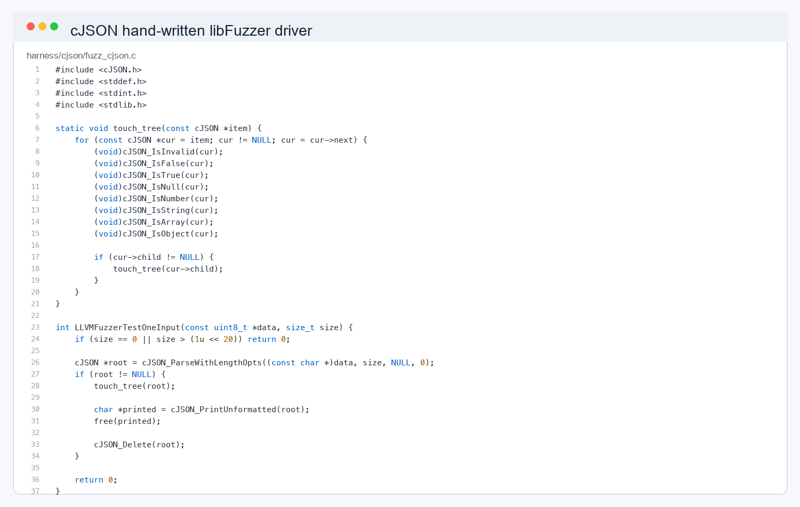
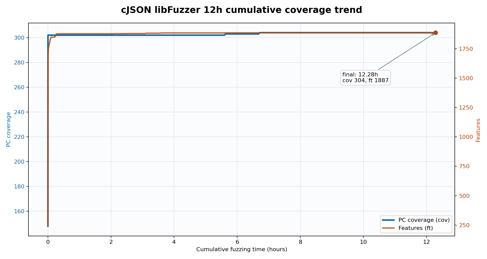
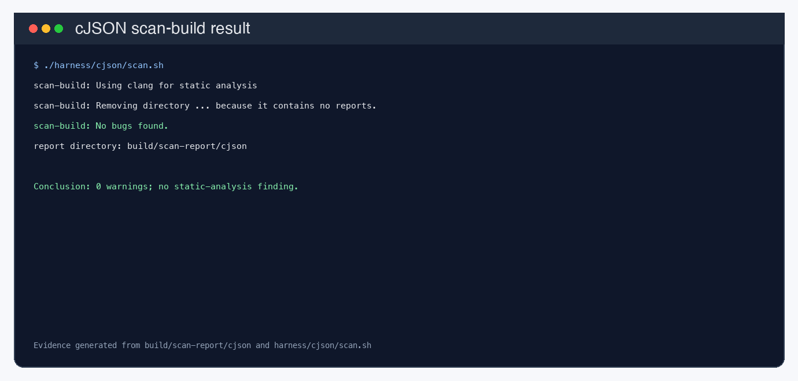
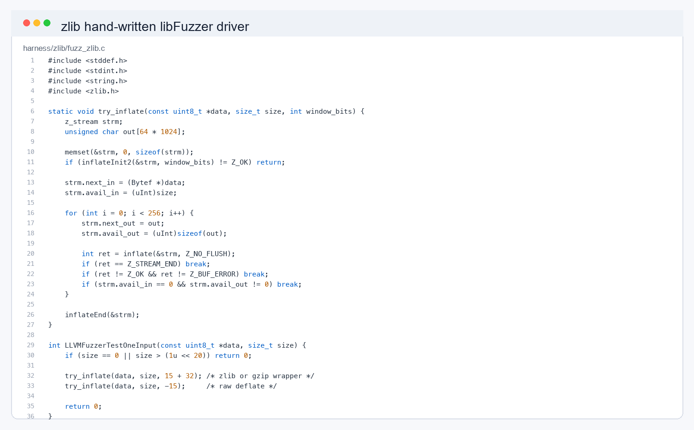
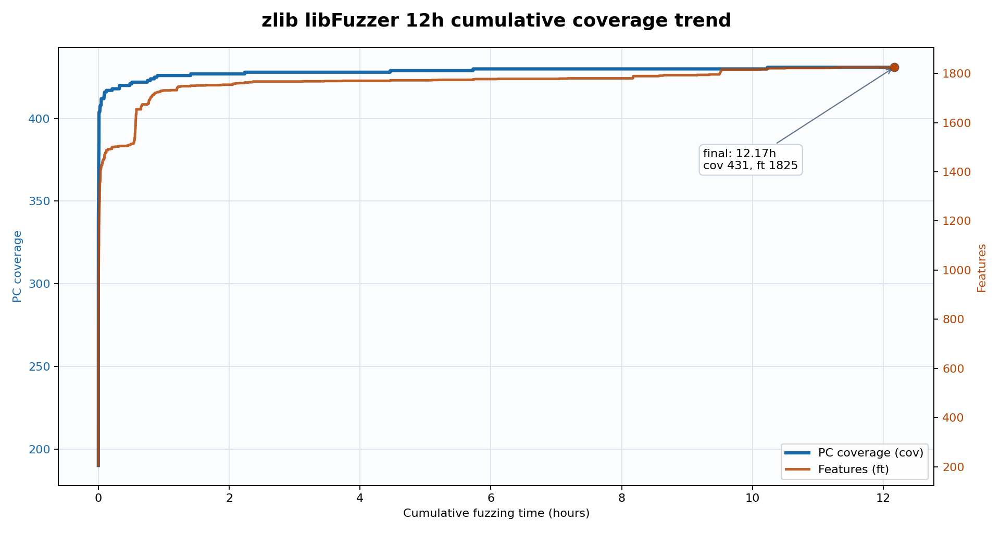
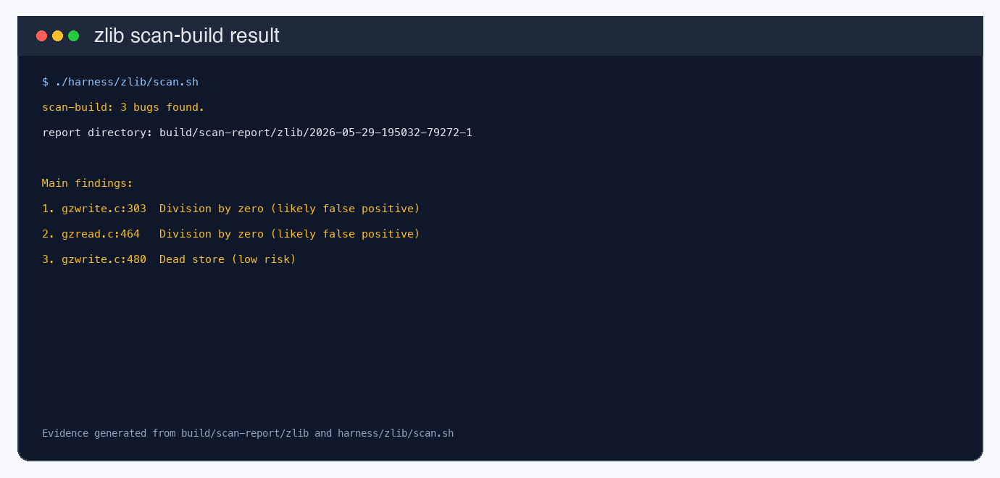
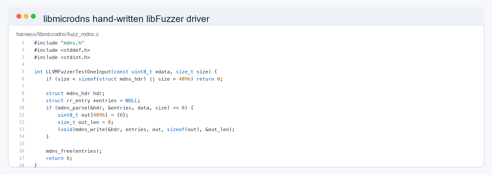
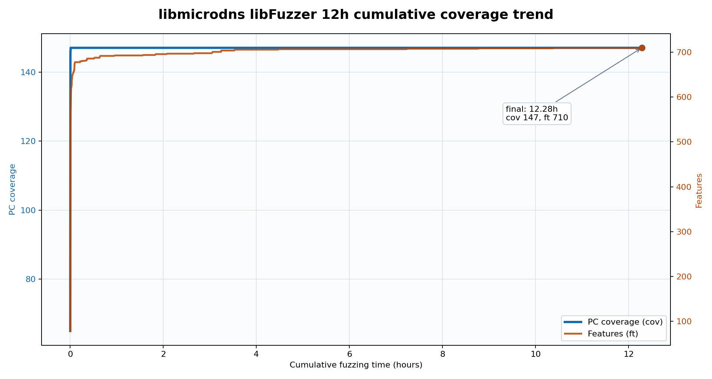
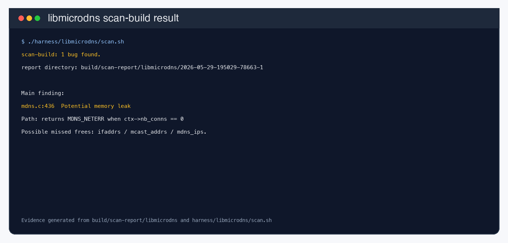

# cJSON / zlib / libmicrodns 12 小时 Fuzz 测试报告

## 1. 实验目标

本次实验选择 cJSON、zlib、libmicrodns 三个 C/C++ 开源项目，使用 libFuzzer 结合 AddressSanitizer 进行累计约 12 小时的动态模糊测试，并辅以 scan-build 静态分析结果，观察是否能够发现 crash、OOM、timeout 或潜在缺陷。

三个项目的测试重点如下：

| 项目 | 测试对象 | Harness |
|---|---|---|
| cJSON | JSON 解析、打印、对象/数组访问与释放路径 | `harness/cjson/fuzz_cjson.c` |
| zlib | gzip/zlib/raw deflate 解压路径 | `harness/zlib/fuzz_zlib.c` |
| libmicrodns | mDNS/DNS resource record 解析路径 | `harness/libmicrodns/fuzz_mdns.c` |

评测对象的本地版本和规模如下。三个项目都来自作业给定列表，覆盖 JSON 解析、压缩格式解析、网络协议解析三类不同输入结构。

| 项目 | 本地版本 | 源码位置 | C/C 头文件规模 |
|---|---|---|---:|
| cJSON | `v1.7.19-5-gfb16e5c` | `targets/targets/cJSON` | 22,381 行 |
| zlib | `v1.3.2-14-gf9dd600` | `targets/targets/zlib` | 42,061 行 |
| libmicrodns | `0.2.0-8-g447b489` | `targets/targets/libmicrodns` | 2,914 行 |

## 2. 实验环境与方法

本次测试在 macOS 环境下运行，使用 clang/libFuzzer 编译各项目 fuzz driver，并开启 AddressSanitizer。所有轮次均复用 `build/corpus/<proj>` 中的 working corpus，属于累计 fuzz，而不是每轮从空语料重新开始。

主要运行命令如下：

```bash
TIME=3600 ./harness/cjson/run.sh
TIME=3600 ./harness/zlib/run.sh
TIME=3600 ./harness/libmicrodns/run.sh

TIME=28800 ./harness/cjson/run.sh
TIME=28800 ./harness/zlib/run.sh
TIME=28800 ./harness/libmicrodns/run.sh
```

完整分轮日志保存在：

- `build/logs/cjson/`
- `build/logs/zlib/`
- `build/logs/libmicrodns/`

详细流水记录见 `report-1h.md`。

## 3. 运行轮次

| 轮次 | 日志时间 | 目标时长 | 说明 |
|---|---|---:|---|
| Smoke test | `20260529-193957` | 10 min | 初始连通性测试 |
| 第一轮 | `20260530-155512` | 1 h | 复用 smoke corpus |
| 第二轮 | `20260530-182736` | 1 h | 继续累计 |
| 第三轮 | `20260530-193325` | 1 h | 继续累计 |
| 第四轮 | `20260530-232517` | 8 h | 主要长时间测试 |
| 第五轮 | `20260531-101559` | 1 h | 8 小时后追加测试 |

由于 fork 模式在到达 `max_total_time` 后仍会完成当前 job 并收尾，实际每个项目累计运行时间略高于 12 小时。

## 4. 累计动态测试结果

| 项目 | 累计运行时间 | 累计执行次数 | 最终 cov | 最终 ft | 最终 working corpus 文件数 | findings | crash/OOM/timeout |
|---|---:|---:|---:|---:|---:|---:|---|
| cJSON | 44,215s / 12.28h | 2,945,830,209 | 304 | 1,887 | 569 | 0 | 0 / 0 / 0 |
| zlib | 43,805s / 12.17h | 188,234,819 | 431 | 1,825 | 2,740 | 0 | 0 / 0 / 0 |
| libmicrodns | 44,207s / 12.28h | 1,712,036,030 | 147 | 710 | 267 | 0 | 0 / 0 / 0 |

本次累计测试未产生 `crash-*`、`oom-*`、`timeout-*` artifact。测试结束后检查 `build/findings/cjson`、`build/findings/zlib`、`build/findings/libmicrodns`，三个目录均无 findings 文件。

## 5. 覆盖率变化

| 项目 | Smoke 结束 cov/ft | 12h 结束 cov/ft | 覆盖变化 |
|---|---:|---:|---|
| cJSON | 302 / 1,849 | 304 / 1,887 | cov +2，ft +38 |
| zlib | 417 / 1,492 | 431 / 1,825 | cov +14，ft +333 |
| libmicrodns | 147 / 678 | 147 / 710 | cov +0，ft +32 |

从变化趋势看，zlib 在长时间累计 fuzz 中收益最高，PC 覆盖和 features 都持续增长。cJSON 只在 8 小时长跑阶段获得少量新覆盖，后续 1 小时没有继续增长。libmicrodns 的 PC 覆盖从 smoke test 后一直停留在 147，只在 features 层面有小幅增加。

## 6. 分项目分析

### cJSON

cJSON 的执行速度最高，12 小时累计执行约 29.46 亿次。最终 PC 覆盖为 304，features 为 1,887。测试未发现崩溃、OOM 或超时。

现有 driver 主要覆盖 JSON 解析、打印、对象访问和释放路径。由于覆盖增长很早进入平台期，继续延长当前 driver 的收益较低。若后续继续改进，应优先加入 `cJSON_Utils` 相关 API，例如 JSON Pointer、patch、merge、duplicate 等路径。

### zlib

zlib 最终累计执行约 1.88 亿次，最终 PC 覆盖为 431，features 为 1,825。相比 smoke test，zlib 增加了 14 个 PC 覆盖点和 333 个 features，是三个项目中动态测试增量最明显的目标。

当前 driver 对输入尝试 gzip、zlib wrapper 和 raw deflate 解压模式，因此单次执行成本高于 cJSON 和 libmicrodns，但覆盖增长更稳定。后续若继续扩展，可以加入 deflate 压缩路径、`inflateBack`、`gzread/gzwrite` 文件 API、preset dictionary 等接口。

### libmicrodns

libmicrodns 最终累计执行约 17.12 亿次，最终 PC 覆盖为 147，features 为 710。测试未发现崩溃、OOM 或超时。

现有 driver 能覆盖基础 DNS/mDNS resource record 解析路径，但 PC 覆盖长期不增长，说明现有 seeds 和变异方式难以触达更深分支。后续提升重点应放在结构化输入上，例如多 answer、多 additional record、name compression、异常 `rdlength`、SRV/TXT 边界长度、多 question/answer section 组合等。

## 7. 静态分析结果

scan-build 结果如下：

| 项目 | scan-build 结果 | 说明 |
|---|---:|---|
| cJSON | 0 个告警 | 未发现静态分析告警 |
| zlib | 3 个告警 | 2 个疑似除零告警，1 个 dead store |
| libmicrodns | 1 组告警 | `ctx->nb_conns == 0` 返回路径上可能存在资源未释放 |

zlib 的两处除零告警位于 `gzwrite.c:303` 和 `gzread.c:464`，初步判断更像静态分析器无法证明特定分支条件下除法不会发生。另有一处 `gzwrite.c:480` dead store，风险较低。

libmicrodns 的告警位于 `mdns.c:436` 附近，涉及 `ctx->nb_conns == 0` 返回路径上 `ifaddrs`、`mcast_addrs`、`mdns_ips` 可能未释放。相比 zlib 的告警，这条更值得后续人工复核。

## 8. 作业要求截图证据

按作业要求，每个项目均给出三类证据：手写 driver/fuzzer、12 小时 fuzz 覆盖趋势、静态分析工具运行结果。为控制报告篇幅，截图按项目压缩排版如下。

| 项目 | 手写 driver/fuzzer | 12 小时 fuzz 覆盖趋势 | 静态分析工具运行结果 |
|---|---|---|---|
| cJSON |  |  |  |
| zlib |  |  |  |
| libmicrodns |  |  |  |

## 9. Agent 工具流设计

本次实验中，AI 助手主要承担环境搭建、driver 设计、日志汇总、静态分析结果解释和改进建议生成。一个可复用的漏洞挖掘 Agent 流程可以设计为“目标理解 -> harness 生成 -> 动态 fuzz -> 静态分析 -> 结果归并 -> 人工复核”的闭环。

| 阶段 | Agent 作用 | 结合工具 |
|---|---|---|
| 目标建模 | 阅读 README、测试用例和公开 API，识别可由字节流驱动的解析入口 | `rg`、源码索引、项目测试集 |
| Driver 生成 | 生成最小 `LLVMFuzzerTestOneInput`，补充资源释放和长度边界检查，避免 driver 自身引入误报 | clang、libFuzzer、AddressSanitizer |
| 种子和字典生成 | 从项目 tests/examples 提取合法样本，再根据格式语法补充 token 字典 | 项目测试集、格式文档、脚本化提取 |
| 动态测试调度 | 先跑 smoke test，再根据覆盖增长决定是否扩展 driver、补种子或进入长跑 | `run.sh`、libFuzzer 日志、coverage plot |
| 静态分析 | 对 scan-build 告警做路径解释，区分明显误报、低风险问题和需要复核的问题 | `scan-build`、源码路径分析 |
| 结果归并 | 将 crash/OOM/timeout、覆盖趋势和静态告警合并，形成优先级列表 | ASan SUMMARY、日志解析、去重脚本 |
| 人工复核 | 对可能真实的问题构造 PoC，确认项目本身 bug 后再提交 issue | lldb、最小化样本、上游 issue 检索 |

Agent 不能直接替代人工确认。它更适合作为“放大器”：自动完成重复性的构建、运行、日志解析和初步归因，把人工时间集中到 PoC 复现、误报反驳和安全影响判断上。

## 10. 未发现确认漏洞的原因与改进

本轮 12 小时动态测试没有发现 crash、OOM、timeout 或可复现崩溃样本，主要原因如下：

- cJSON 的 parser/printer 主路径较短，当前 driver 很早进入覆盖平台期，继续单纯延长时间收益低。
- zlib 的输入格式约束强，随机变异能稳定增加 features，但要触发更深 API 需要扩展到压缩、`gz*` 文件接口和 preset dictionary。
- libmicrodns 的协议结构性较强，当前种子能进入基本 RR 解析，但难以系统覆盖多 section、name compression 和异常长度组合。
- 静态分析告警中，zlib 两处除零更像路径约束误报；libmicrodns 的资源释放问题尚未构造出可确认 PoC，因此没有作为“最新版真实 bug”提交上游 issue。

后续改进应优先做三件事：一是为 cJSON 增加 `cJSON_Utils` driver；二是为 zlib 增加压缩和文件 API harness；三是为 libmicrodns 生成结构化 DNS/mDNS 样本，并针对 `mdns.c:436` 的返回路径做人工复现。

## 11. 结论

本次对 cJSON、zlib、libmicrodns 进行了累计约 12 小时的 libFuzzer + AddressSanitizer 测试，未发现 crash、OOM、timeout 或可复现崩溃样本。

从测试收益看，zlib 是三个项目中最适合继续投入 fuzz 时间的目标，覆盖率和 features 在长跑中仍有增长。cJSON 当前 driver 已基本进入平台期，继续测试前更适合扩展 `cJSON_Utils` 等 API 覆盖。libmicrodns 当前 PC 覆盖停滞，继续提升需要补充更结构化的 DNS/mDNS 种子，而不是单纯延长运行时间。

综合动态 fuzz 和静态分析结果，当前没有确认的高危漏洞；后续最值得复核的是 libmicrodns 静态分析中提示的资源释放路径问题。
